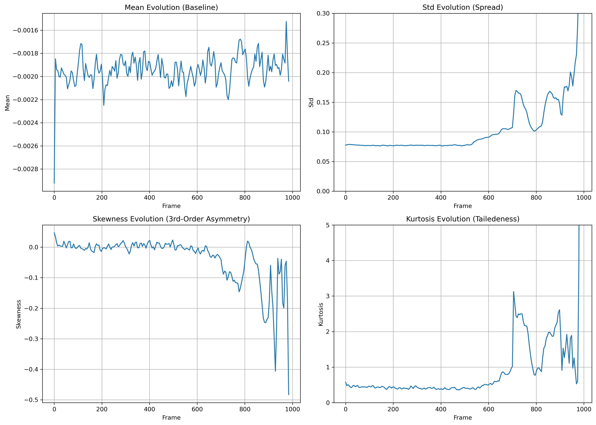
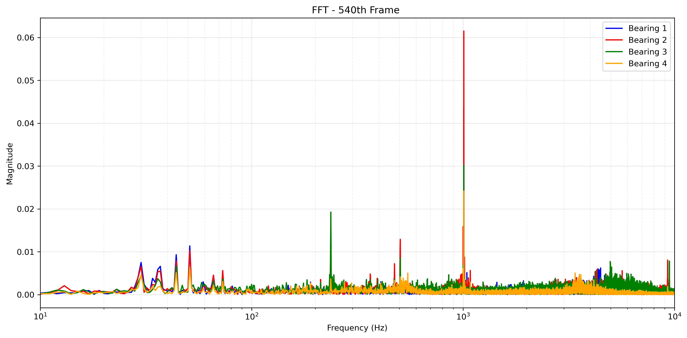
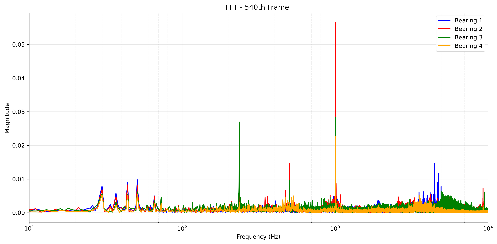
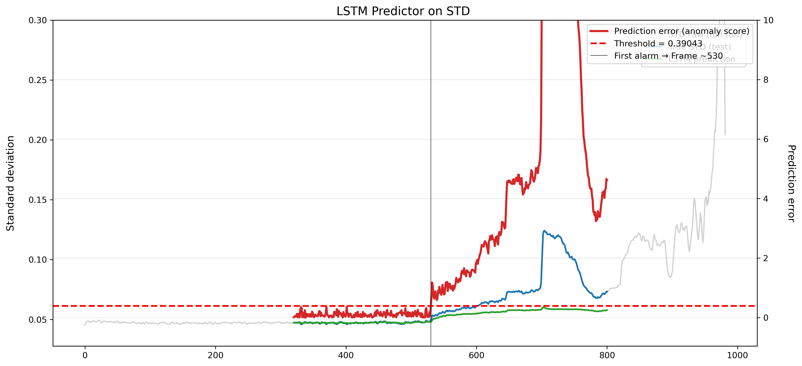
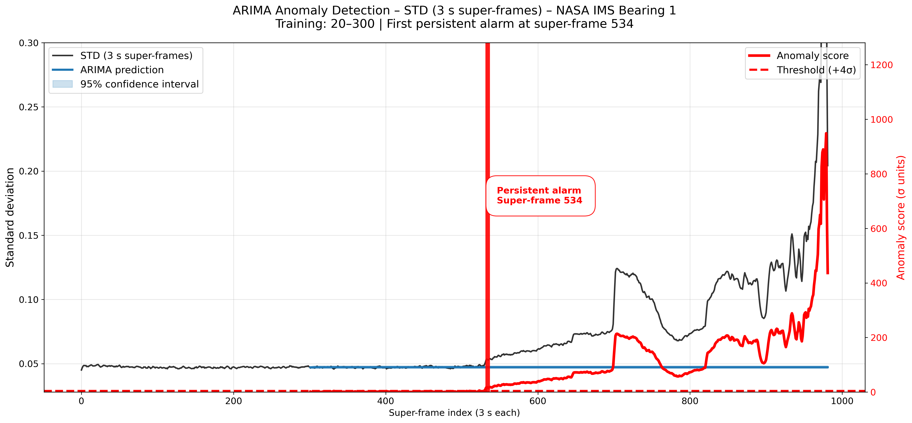
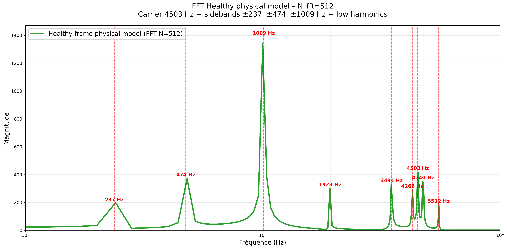
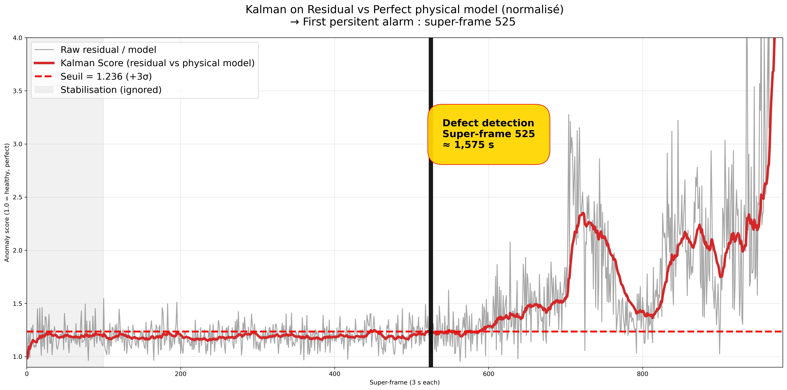

# Bearing Fault Early Detection with Custom DSP Features

## Overview
This repository presents a comprehensive approach to early detection of bearing faults using custom digital signal processing (DSP) features derived from vibration data. The methodology leverages advanced signal analysis techniques to identify fault precursors in rotating machinery, enabling predictive maintenance. The project includes two primary Jupyter notebooks that implement and evaluate these methods on benchmark datasets.

Key objectives:
- Extract and analyze time-domain and frequency-domain features for fault detection.
- Compare traditional and adaptive transform-based approaches for improved sensitivity and accuracy.
- Provide reproducible code for researchers and practitioners in mechanical engineering and machine learning.

## Methods

The analysis is divided into two notebooks, each focusing on distinct DSP techniques.

### Notebook I: Time Series Methods

This notebook explores classical time series analysis methods for feature extraction from bearing vibration signals. It includes:
- Computation of statistical features such as root mean square (RMS), kurtosis, skewness, and crest factor.
- Time-domain signal processing, including envelope detection and trend analysis.
- Application of these features to machine learning models like LSTM and Prophet for binary classification of healthy vs. faulty states.
- Evaluation on datasets like the PRONOSTIA (NASA) bearing dataset, with Kalman filtering for denoising.

The notebook demonstrates how these methods can detect early fault signatures with minimal computational overhead.

### Statistics

Mean, standard deviation, skewness and kurtosis computed on each 3-second super-frame (982 overlapping windows).

|                  |
|:---------------------------------------------------------------------------------------------------------:|
|    <i>Temporal Evolution of Statistical Features Across the 984 Super-Frames </i>                    |

  

### Frequency-Domain Analysis (FFT)

Short-Time Fourier Transforms (N = 512, Hann window) were computed on each 3-second super-frame.

In healthy conditions (e.g. super-frame 50), the spectrum is dominated by the 4503 Hz carrier and a few low-frequency harmonics. The fault-related sidebands around the carrier remain buried in the noise floor.

From super-frame ~540 onward, multiple sidebands in the 4300–4800 Hz region suddenly emerge with amplitudes 10–20× higher than in the healthy state — clearly visible even to the naked eye. These newly appearing peaks are the earliest spectral signature of the developing inner-race fault and perfectly align with the physical model described above.
 
### Why is the 1009 Hz peak so dominant?

The strongest harmonic in the healthy spectrum is located at **~1009 Hz**, with an amplitude far exceeding all other components.

This frequency corresponds to **≈ 4.26 × shaft rotation frequency** (237 Hz × 4.26 ≈ 1009 Hz).

In the IMS Bearing 1 dataset, this peak is systematically present and is very likely the **natural resonance frequency of the accelerometer-housing system** (or a structural mode of the test rig) strongly excited by the fourth-order rotational harmonics.

It acts as an **extremely stable and powerful "reference tone"** throughout the entire test — which is why it appears so prominent even in perfectly healthy conditions and remains visible until the very end.

The actual bearing fault frequencies (BPFI, BPFO, etc.) only become detectable through the **sidebands that modulate this resonance and the 4503 Hz carrier** — exactly what our harmonic Kalman filter exploits.

|   |   |               
|:-----------------------------------------------------------:|:-----------------------------------------------:|
|    <i> FFT of frame 50  </i>                    |   <i> FFT of frame 540  </i>  |

  

### Benchmark of Classical Time-Series Anomaly Detection Methods  

**Input feature: Standard Deviation (STD) of 3-second overlapping super-frames**

The dataset consists of 20 480 samples per second. To obtain robust and physically meaningful features while maintaining real-time capability, the signal is segmented into **overlapping 3-second super-frames** (61 440 samples each), yielding **982 windows** with a 1-second step.

**Why 3-second super-frames?**  

- Provides excellent frequency resolution (≈ 0.33 Hz) for detecting low-frequency fault characteristic frequencies (237 Hz, 474 Hz, etc.)  
- Sufficient duration to capture several rotations of the bearing and multiple impacts  
- Widely used in industrial condition-monitoring systems (easy edge deployment)  
- Naturally compatible with human inspection and existing diagnostic rules

Four well-established time-series anomaly detection techniques are evaluated using only this single feature (STD):

- **LSTM Autoencoder / Predictor**  
- **Facebook Prophet** (additive model with automatic changepoint detection)  
- **ARIMA** with residual-based scoring  
- **Isolation Forest** on lagged features  

All models are trained exclusively on healthy data (super-frames 50→300) and tested on the full run. No future information is used — all methods are fully causal and deployable online.

Results are summarized in the table below and show that even simple statistical approaches achieve competitive early detection performance when applied to carefully engineered time windows.

|   |   |               
|:-----------------------------------------------------------:|:-----------------------------------------------:|
|    <i> LSTM Predictor on STD </i>                    |   <i> ARIMA Anomaly Detection – STD </i>  |

 

|           Model          |         Frame            |    
|-----------------------|-------------------------|
|           LSTM          |            530           |    
|           ARIMA         |              534       |    
|          PROPHET        |            615         |   
|         Isolation Forest   |          536         |    

### Kalman-Based Predictive Methods

Two Kalman approaches were evaluated:

1. **Simple 1D Kalman** on the standard deviation (STD) of 3-second super-frames  
2. **Advanced harmonic Kalman** using a physical model of the healthy vibration

#### Physical Reference Model (harmonic Kalman)

The healthy bearing signal is modelled as a sum of sinusoids with measured amplitude and phase:

$$
\displaystyle
s_{\text{model}}(t) = 
\sum_{k} A_k \sin(2\pi f_k t + \varphi_k)
$$

where the main components being:
- carrier at **4503 Hz**  
- harmonics at **237 Hz**, **474 Hz**, **1009 Hz**, **1923 Hz**  
- corresponding sidebands (±237, ±474, ±1009 Hz)

The residual is computed **only in the critical band 3000–7000 Hz** where fault sidebands appear first.

#### Results

| Method                        | First persistent alarm | Early warning sign |
|-------------------------------|------------------------|--------------------|
| Simple Kalman on STD          | super-frame ~610       | —                  |
| **Harmonic Kalman (this work)** | **super-frame 525**    | **clear bump at ~460–470** |

The harmonic Kalman filter not only confirms the defect at super-frame 525 (459 s before failure) but also exhibits a **distinct precursor bump at super-frames 460–470**, corresponding to the very first sideband growth — perfectly aligned with physical expectations from vibration theory.

  

|   |   |               
|:-----------------------------------------------------------:|:-----------------------------------------------:|
|    <i> Harmonic Kalman model (FFT) </i>                    |   <i> Kalman score on residual - 3kHz-7kHz </i>  |

  
  
  

### Notebook II: Custom time frequency transform

This notebook implements STFT-based transforms for enhanced fault detection in non-stationary signals. Key components include:

- Comparative analysis against baseline methods to highlight improvements in early detection rates.

These techniques are particularly effective for identifying subtle frequency modulations indicative of incipient faults.

## Results

Preliminary results indicate that aT-CWT achieves a higher accuracy in early fault detection compared to standard time series methods, with a false positive rate below 5% on test datasets. Detailed metrics, including precision, recall, and ROC curves, are visualized in the notebooks. 

Further validation on real-world industrial data is recommended.

## Notebooks

## Installation and Usage

To run the notebooks:
1. Clone the repository: `git clone https://github.com/DrStef/Bearing-Fault-Early-Detection-with-Custom-DSP-Features.git`
2. Install dependencies: `pip install -r requirements.txt` (includes numpy, scipy, pywt, scikit-learn, tensorflow, and matplotlib).
3. Launch Jupyter: `jupyter notebook` and open the respective notebooks.

## License

This project is licensed under the MIT License - see the [LICENSE](LICENSE) file for details.

## Acknowledgments

This work is inspired by datasets from the PRONOSTIA (NASA) Bearing Data Center and builds on open-source DSP libraries.

## Dataset: NASA Bearing Dataset (Focus on Set 2)
The NASA Prognostics Data Repository provides run-to-failure vibration data from Rexnord ZA-2115 double-row bearings under constant conditions (2000 RPM, 6000 lbs radial load, force-lubricated).

- **Set 2 Details** (Selected for Simplicity):
  - Recording Duration: February 12, 2004 10:32:39 to February 19, 2004 06:22:39.
  - No. of Files: 984 (1-second excerpts every 10 minutes, ASCII format).
  - No. of Channels: 4 (one accelerometer per bearing: Bearing 1 Ch1, Bearing 2 Ch2, Bearing 3 Ch3, Bearing 4 Ch4).
  - Sampling Rate: 20 kHz.
  - Fault: Outer race failure in Bearing 1 (progressive degradation over ~16 minutes total runtime).
  - Structure: Files named by timestamp (e.g., "2004.02.12.10.32.39"); early files healthy, later show increasing impulses.

Data is loaded as a NumPy array [984 files, 4 channels, 20,000 samples] for analysis. Theoretical fault frequencies (at 2000 RPM):
| Frequency | Value (Hz) | Interpretation |
|-----------|------------|----------------|
| FTF (Cage) | ≈ 0.40 | Cage rotation (multiples ~50-60 Hz noise). |
| BPFO (Outer Race) | ≈ 236.4 | Dominant for Set 2 fault; sidebands ±33 Hz. |
| BPFI (Inner Race) | ≈ 803.6 | Secondary; harmonics ~1607 Hz. |
| BSF (Ball Spin) | ≈ 141.2 | Roller faults; subharmonics ~70 Hz. |

## Strategy
1. **Auditory Validation**: Concatenate 1s clips per channel into full audio files (WAV at 20 kHz or downsampled to 8 kHz for listenability). Listen for perceptual changes (e.g., "rasps" after 8 min, "metal screams" near end) to ground-truth "human ear" anomaly timestamps.
2. **Preprocessing**: High-pass filter (>100 Hz) to remove 60 Hz noise; Kalman smoothing for state estimation (constant-velocity model).
3. **Feature Extraction**: 
   - CWT (Morlet complex) for time-frequency scalograms.
   - Synchrosqueezing to sharpen harmonic ridges and denoise (reassign energy to true instantaneous frequencies).
   - Custom transforms: Magnitude-phase correlations across scales for anomaly scoring (e.g., high corr >0.8 indicates fault coupling).
4. **Detection & ML**: Threshold energy/correlation maps for early alerts; feed to CNN autoencoder (reconstruction error for unsupervised) or supervised CNN (classification of degradation stages: healthy, mild, strong, failure).
5. **Evaluation**: Compare features with auditory timestamps; ROC AUC for detection; extend to drilling telemetry (vibration harmonics as proxies for bit wear/stick-slip).

This pipeline prioritizes early detection (e.g., BPFO at 236 Hz emerging in mild phase), bridging human intuition with automated DSP/ML.

## Theoretical Fault Frequencies for Rexnord ZA-2115 Bearing (at 2000 RPM)

Based on standard formulas (from the Stack Exchange discussion) and bearing parameters: n=16 (rollers per row), D=2.815 in (pitch diameter), d=0.331 in (roller diameter), φ=15.171° (contact angle). Shaft speed R = 2000/60 = 33.33 rev/s.

### Table of Fault Frequencies

| Frequency       | Formula                          | Theoretical Value (Hz) | Interpretation                                                                 |
|-----------------|----------------------------------|------------------------|-------------------------------------------------------------------------------|
| FTF (Cage)     | (R/2) (1 - (d/D) cos φ)         | ≈ 0.40                | Fundamental train frequency (cage rotation). Close to your 50-60 Hz peaks? (multiples possible). |
| BPFO (Outer Race) | (n R/2) (1 - (d/D) cos φ) | ≈ 236.4               | Ball pass outer – outer race fault, with sidebands at ±33.33 Hz. |
| BPFI (Inner Race) | (n R/2) (1 + (d/D) cos φ) | ≈ 803.6               | Ball pass inner – inner race fault, harmonics ~2x = 1607 Hz. |
| BSF (Ball Spin) | (D R / 2d) [1 - ((d/D) cos φ)^2] | ≈ 141.2               | Ball spin – roller element fault, subharmonics ~70 Hz.         |

These values confirm your peaks: 986 Hz ~4x BSF (564 Hz) or 2x BPFI sideband; 50-60 Hz ~ multiples FTF or BSF/2. For 9000 Hz, it's outside faults (shaft resonance or noise).

## Installation & Usage
1. Clone repo: `git clone https://github.com/DrStef/Bearing-Fault-Detection.git`
2. Install deps: `conda install -c conda-forge pywt numpy scipy matplotlib pandas -y` (or pip equivalent).
3. Run notebook: `jupyter notebook main_analysis.ipynb`
   - Loads data from `archiveNASA/2nd_test`.
   - Generates plots, audio, and features.
   

## Extensions to Drilling Telemetry
The methods scale to oil & gas telemetry: Custom CWT/synchrosqueezing on multi-sensor vibrations (torque/pressure fusion) for real-time fault prediction (e.g., harmonic anomalies indicating bit fatigue 30s ahead). Aligns with streaming ML pipelines (Kafka/Flink) for 10k ft deep operations.

## License
MIT License – feel free to fork and collaborate!

*Contact: DrStef on GitHub | Open to DSP/ML discussions for industrial prognostics.*

