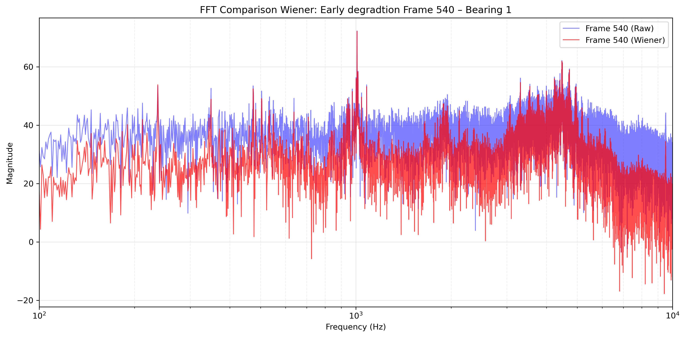
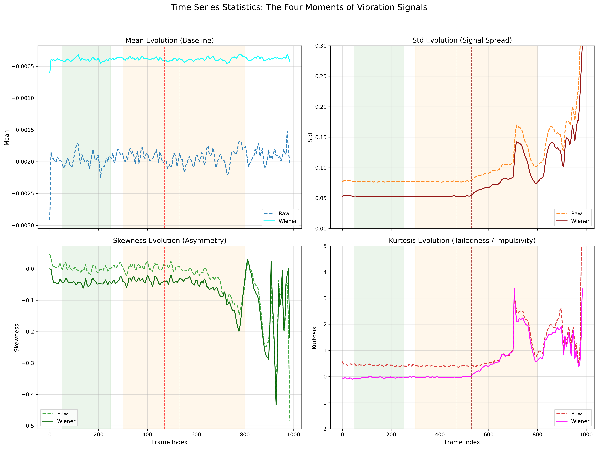
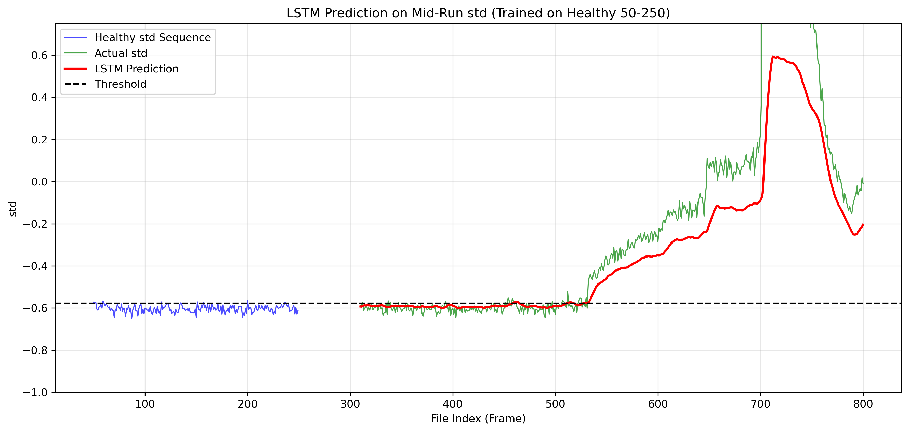
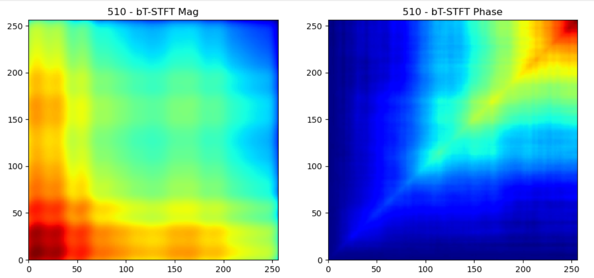
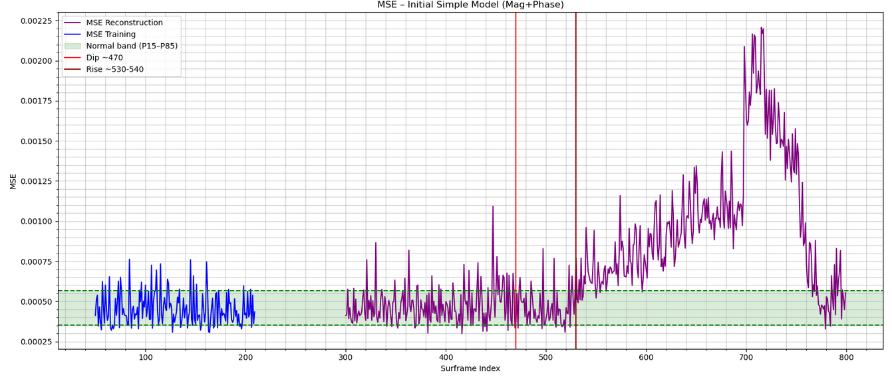
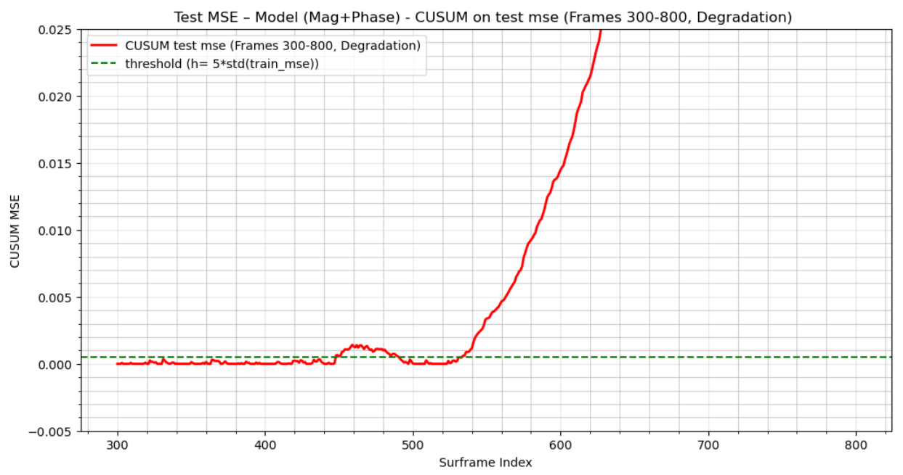
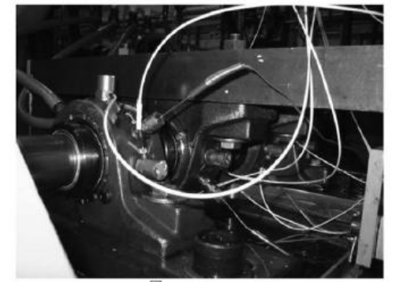
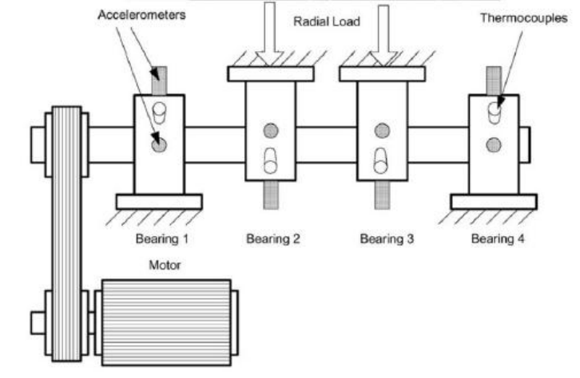

# Bearing Fault Early Detection with Custom DSP Features

<h1>PHASE II - NASA Bearing Dataset</h1>
<h1> Part I: Time Series & Spectral Analysis (FFT) with Wiener Denoising</h1><

## Overview

This part focuses on foundational time series analysis of vibration data from the **NASA IMS Bearing Dataset** (run-to-failure experiments), with the goal of early fault detection for industrial predictive maintenance. We extract raw acceleration signals, convert them to audible audio for qualitative listening (to "hear" emerging faults), and apply spectral analysis via FFT to identify frequency signatures. To improve signal quality, we apply **Wiener filtering** for denoising, using only the denoised data for subsequent modeling. Finally, we evaluate time series modeling with LSTM to capture long-term dependencies and anomaly patterns in the 984-second recordings, where faults emerge around frame 500–540.

 **Dataset 2 Focus**: We focus exclusively on Dataset 2 (simpler 4-channel setup, 984 frames, fs=20480 Hz), loading **Channel 1** for Bearing 1 outer race fault analysis. This channel serves as the primary input for Wiener denoising and subsequent time-series modeling. 

### Key Objectives
- **Data Extraction & Preprocessing**: Load and segment the 16-minute recording into 984 one-second frames; normalize and prepare for consistency.
- **Audio Visualization**: Generate WAV files from vibration signals (scaled to audible range) to qualitatively assess fault progression by ear.
- **Spectral Insights**: Compute FFT to reveal harmonic peaks (e.g., BPFO/BPFI) indicative of bearing degradation.
- **Denoising with Wiener Filter**:  
  The Wiener filter is applied using a background noise estimate constructed from healthy frames (early part of the recording). Noise profile is derived from clean segments (e.g., frames 50–250), focusing on broadband noise characteristics while preserving the natural mechanical signatures of the rig (rotation harmonics, low-frequency modes). This approach avoids leakage from degradation signatures and ensures the filter targets only the unwanted noise floor.
- **Advanced Modeling**:
  - **LSTM**: Captures long-term dependencies in the filtered time series for anomaly scoring and early fault detection.

The denoised signal serves as the primary input for modeling, enabling more reliable detection of subtle changes before traditional metrics (RMS, kurtosis) show clear degradation.

## Main Results

This section highlights the key outcomes from the analysis on the Wiener-denoised signal (Channel 1, Bearing 1 outer race fault). All figures are generated from the pipeline in this notebook.

### 1. Wiener Denoising Effect – Frame 540

Wiener filtering significantly reduces broadband noise while preserving fault-related features. The spectrum comparison on Frame 540 shows a cleaner noise floor and improved SNR on emerging high-frequency peaks (3000–7000 Hz), making degradation signatures more visible compared to the raw signal.

     

<i>Figure 1: FFT magnitude comparison – Raw vs Wiener-denoised on Frame 540. High-frequency peaks are clearly enhanced.</i>

        

### 2. Time-Domain Statistics: Raw vs Wiener Denoised

Wiener denoising flattens the healthy baseline and sharpens fault indicators:
- Mean: minimal variation in both cases (near zero, low diagnostic value).  
- STD: overall level reduced; the "blip" (variance crushing ~470–530) becomes more defined, and the rise at ~540 is more pronounced.  
- Skewness: slightly flatter after denoising (less sensitive).  
- Kurtosis: much cleaner healthy baseline (close to 0 until ~540), with a sharper, more violent increase at 540 – the strongest early indicator.

<i>Figure 2: Evolution of mean, STD, skewness, and kurtosis – Raw (dashed) vs Wiener-denoised (solid). Denoising improves clarity, especially on kurtosis and STD.</i>

### 3. LSTM Sequential Prediction on STD

An LSTM model trained on healthy STD sequences (window=10, frames 0–300) predicts future STD values. The prediction closely tracks the actual STD during healthy and transitional phases, but shows a clear deviation starting around frame ~460–470, with a strong excursion at ~540. This confirms LSTM's ability to anticipate variance changes early.

<i>Figure 2: LSTM predicted STD (blue dashed) vs actual (red), with early deviation visible ~460–470 and strong rise at 540.</i>

 
These results demonstrate that Wiener denoising + LSTM on STD enables reliable early fault detection (\~460–470), significantly ahead of traditional thresholds (~540). Part II will explore custom bTSTFT features for even higher precocity/reliability.

## Conclusions Part I

Wiener denoising, using a noise vector constructed from healthy frames (filtered and averaged to capture broadband background noise while preserving rig harmonics), proved highly effective in enhancing the visibility of high-frequency harmonics (3000–7000 Hz) during early degradation. This preprocessing step significantly improved the clarity of time-domain statistics (STD, kurtosis) and sequential modeling.

- **Time-domain features** (mean, STD, skewness, kurtosis): Wiener reduces baseline noise, making the subtle "variance crushing" blip (\~460–530) more defined and the sharp impulsivity spike at \~540 more pronounced. Kurtosis becomes a particularly clean and sensitive indicator after denoising.
- **LSTM on STD**: Trained on healthy frames (50–250), the model anticipates variance changes with a pre-alarm at frame \~458 using a threshold of mean(healthy_std) + 1.5 × std(healthy_std). This is significantly earlier than the strong deviation at frame 540 (~9 minutes), demonstrating the value of sequential modeling on denoised features. **However, the threshold remains sensitive and carries some risk of false positives due to minor healthy fluctuations.**

Wiener denoising stands out as the key enabler, delivering a cleaner signal that boosts both classical statistics and advanced modeling. While LSTM provides promising early alerts (~458), future work in Part II will leverage the custom bTSTFT transform and CNN autoencoder to achieve even more robust, precise, and risk-reduced early fault detection (~458–473 or better).

<h1>Part II: Early Fault Detection with Custom btstft Transform</h1>

## Overview

This notebook presents a robust and highly sensitive method for **early fault detection** in the NASA IMS Bearing Dataset (Set 2, run-to-failure experiment with progressive inner race degradation).

The core innovation relies on the custom **bTSTFT** (broadband Time-Continuous Wavelet Transform with phase perturbations) transforms, which have been **precomputed** in Part I on the **Wiener-denoised vibration signal** (16-minute recording, single channel, Bearing 1). These transforms are stored in .npy files as 980 matrices of shape (256, 256, 2) — magnitude and phase — derived from sliding surframes of 5 consecutive 1-second frames (stride = 1 frame, no overlap).

We load these precomputed bTSTFT tensors directly and feed them into a **convolutional autoencoder (CNN-based)** trained in an unsupervised manner on the healthy portion of the data (early frames). The model learns to reconstruct normal vibration patterns. During inference on the later portion of the recording, we compute the **reconstruction error (MSE per surframe)** and analyze its behavior.

Key observations:
- A **strong and sustained deviation** in MSE appears as early as **~frame 460**, well before traditional time-series metrics (RMS, kurtosis) show significant changes (~frame 530–540).
- Applying **CUSUM** (Cumulative Sum) on the MSE time-series confirms this early excursion, providing a robust statistical alarm signal starting around frame 460.
- A **causal FFT-based score** computed on the MSE sequence (high-frequency power analysis with rolling window) also detects the anomaly around frame 460, reinforcing the precocity of the method.

These results demonstrate that the combination of Wiener denoising, custom bTSTFT feature extraction, CNN autoencoder reconstruction, and simple temporal post-processing (CUSUM + causal FFT) achieves **very early detection** of bearing degradation — potentially offering dozens to hundreds of frames of lead time compared to conventional approaches.

The following sections detail the loading, autoencoder architecture, MSE computation, anomaly scoring (CUSUM & FFT), and final comparison of detection performance.

## Results

This section summarizes the key visual and quantitative results obtained from the pipeline on the Wiener-denoised signal (Part I) using the custom bTSTFT transform and CNN autoencoder.

### 1. Example of bTSTFT Transform

The following image shows a representative bTSTFT matrix (magnitude + phase) from a surframe in the healthy zone. Note the symmetry with respect to the main diagonal, a natural property arising from the real-valued input signal and the Hermitian symmetry of its Fourier transform.

<i>Figure 4: Example of a precomputed bTSTFT transform (256×256×2) from a surframe 510.</i>

### 2. Reconstruction MSE on Test Set

The reconstruction error (MSE per surframe) on the test portion (frames 300–800) shows a clear early deviation starting around frame 460–470, with a strong and sustained excursion above the threshold.

<i>Figure 5: MSE per surframe on train set and test set (300–800),   with P15/P85 healthy band (green) and early persistent deviation at ~460–470</i>

### 3. CUSUM on MSE for Anomaly Detection

CUSUM applied to the MSE sequence confirms a persistent deviation starting at ~460–470, providing a robust statistical alarm signal well before traditional metrics.

<i>Figure 6: CUSUM on MSE per surframe, showing early and persistent alarm at ~460–470.</i>

                  

# PHASE I:  Preliminary Activities and datasets

## Overview
This repository presents a comprehensive approach to early detection of bearing faults using custom digital signal processing (DSP) features derived from vibration data. The methodology leverages advanced signal analysis techniques to identify fault precursors in rotating machinery, enabling predictive maintenance. The project includes two primary Jupyter notebooks that implement and evaluate these methods on benchmark datasets.

Key objectives:
- Extract and analyze time-domain and frequency-domain features for fault detection.
- Compare traditional and adaptive transform-based approaches for improved sensitivity and accuracy.
- Provide reproducible code for researchers and practitioners in mechanical engineering and machine learning.

## Dataset Overview

The NASA Prognostics Data Repository provides run-to-failure vibration data from Rexnord ZA-2115 double-row bearings under constant conditions (2000 RPM, 6000 lbs radial load, force-lubricated). The NASA Bearing Dataset is a benchmark collection for predictive maintenance and anomaly detection in rotating machinery. It consists of run-to-failure experiments on ball bearings under constant load and rotational speeds (2000-4000 RPM).  

https://www.kaggle.com/datasets/vinayak123tyagi/bearing-dataset/data

- **Test Rig Setup**

From the pdf document: <i>Four bearings were installed on a shaft. The rotation speed was kept constant at 2000 RPM by an AC
motor coupled to the shaft via rub belts. A radial load of 6000 lbs is applied onto the shaft and bearing by a spring mechanism. All bearings are force lubricated. Rexnord ZA-2115 double row bearings were installed on the shaft as shown in Figure 1. 
PCB 353B33 High Sensitivity Quartz ICP accelerometers were installed on the bearing housing (two accelerometers for each bearing [x- and y-axes] for data set 1, one accelerometer for each bearing for data sets 2 and 3). Sensor placement is also shown in Figure 1. All failures occurred after exceeding designed life time of the bearing which is more than 100 million revolutions.</i>

  
|            |           |
|---------|----------|
|         |          |

- **Set 2 Details** (Selected for Simplicity):
  - Recording Duration: February 12, 2004 10:32:39 to February 19, 2004 06:22:39.
  - No. of Files: 984 (1-second excerpts every 10 minutes, ASCII format).
  - No. of Channels: 4 (one accelerometer per bearing: Bearing 1 Ch1, Bearing 2 Ch2, Bearing 3 Ch3, Bearing 4 Ch4).
  - Sampling rate: 20480 Hz (high-resolution vibration signals).
  - Duration: Up to several hours per run, with progressive degradation from normal to failure.
  - Signals: Accelerometer data in X, Y, Z axes (e.g., `X001_DE_time` for drive-end vibrations).
  - Fault: Outer race failure in **Bearing 1** (progressive degradation over ~16 minutes total runtime).
  - Structure: Files named by timestamp (e.g., "2004.02.12.10.32.39"); early files healthy, later show increasing impulses.

Data is loaded as a NumPy array [984 files, 4 channels, 20,480 samples] for analysis. 
This dataset is ideal for testing denoising (Kalman) and time-frequency analysis (btSTFT) to detect early harmonic faults.

### Scope of this Work

**The present study deliberately focuses exclusively on Bearing 1 (channel 1)** for the following reasons:
- Bearing 1 exhibits the most complete and well-characterized run-to-failure trajectory in the dataset (test 2).
- It is the most commonly used as the reference case in the prognostics community, allowing direct comparison with hundreds of published works.
- Concentrating on a single sensor simplifies the analysis and highlights the performance of the proposed method without relying on multi-sensor fusion.

Future work may extend the approach to multi-channel or cross-bearing detection.

## Methods

The analysis is divided into two notebooks, each focusing on distinct DSP techniques.

### Notebook II: Custom Time-Frequency Analysis for Early Fault Detection

- We introduce a novel time-frequency representation specifically designed to reveal incipient bearing faults at the earliest possible stage.  
- We implement an interactive monitoring interface that combines real-time visualization with audio playback, enabling simultaneous magnitude/phase display, and clear highlighting of emerging fault patterns (see the reference video).  
- We train a lightweight convolutional autoencoder exclusively on healthy operating conditions, then apply it to frames 300–900 of the run-to-failure sequence, achieving fully unsupervised detection of the very first signs of bearing degradation.

These techniques are particularly effective for identifying subtle frequency modulations indicative of incipient faults.

 
  

  

<em>Video: Early fault signatures are clearly visible in both magnitude and phase <strong>well before</strong> frames 530–540.</em>

 

#### PhaseMag-AE — Our specialized autoencoder for joint magnitude/phase superframes

- Input: 256×256×2 (magnitude + phase channels from the custom transform superframes)  
- Fully convolutional encoder–decoder (32 → 64 → 128 latent filters)  
- Linear reconstruction head (no clipping) to preserve full dynamic range of both magnitude and phase  
- Trained exclusively on healthy frames → reconstruction error spikes at the very first fault impulses  

PhaseMag-AE detects degradation automatically and unsupervised, typically 150–200 frames (~minutes to hours) before classical indicators.

 

### Notebook I: Time Series Methods

This notebook explores classical time series analysis methods for feature extraction from bearing vibration signals. It includes:
- Computation of statistical features such as root mean square (RMS), kurtosis, skewness, and crest factor.
- Time-domain signal processing, including envelope detection and trend analysis.
- Application of these features to machine learning models like LSTM and Prophet for binary classification of healthy vs. faulty states.
- Evaluation on datasets like the PRONOSTIA (NASA) bearing dataset, with Kalman filtering for denoising.

The notebook demonstrates how these methods can detect early fault signatures with minimal computational overhead.

### Statistics

Mean, standard deviation, skewness and kurtosis computed on each frame (984).

|                  |
|:---------------------------------------------------------------------------------------------------------:|
|    <i>Temporal Evolution of Statistical Features Across the 984 Super-Frames </i>                    |

  

### Frequency-Domain Analysis (FFT)

Short-Time Fourier Transforms (N = 512, Hann window) were computed on each 3-second super-frame.

In healthy conditions (e.g. super-frame 50), the spectrum is dominated by the 4503 Hz carrier and a few low-frequency harmonics. The fault-related sidebands around the carrier remain buried in the noise floor.

From super-frame ~540 onward, multiple sidebands in the 4300–4800 Hz region suddenly emerge with amplitudes 10–20× higher than in the healthy state — clearly visible even to the naked eye. These newly appearing peaks are the earliest spectral signature of the developing inner-race fault and perfectly align with the physical model described above.
 

**Why is the 1009 Hz peak so dominant?**

The strongest harmonic in the healthy spectrum is located at **~1009 Hz**, with an amplitude far exceeding all other components.

This frequency corresponds to **≈ 4.26 × shaft rotation frequency** (237 Hz × 4.26 ≈ 1009 Hz).

In the IMS Bearing 1 dataset, this peak is systematically present and is very likely the **natural resonance frequency of the accelerometer-housing system** (or a structural mode of the test rig) strongly excited by the fourth-order rotational harmonics.

It acts as an **extremely stable and powerful "reference tone"** throughout the entire test — which is why it appears so prominent even in perfectly healthy conditions and remains visible until the very end.

The actual bearing fault frequencies (BPFI, BPFO, etc.) only become detectable through the **sidebands that modulate this resonance and the 4503 Hz carrier** — exactly what our harmonic Kalman filter exploits.

|   |  
|-----------------------------------------------------------|
|   
<i> FFT of <b>frame 50</b> (Bearings 1,2,3,4) </i>
                   |   
|   |  
| 
<i> FFT of <b>frame 540</b> (Bearings 1,2,3,4)  </i>
 |

  

### Benchmark of Classical Time-Series Anomaly Detection Methods  

**Input feature: Standard Deviation (STD) of 3-second overlapping super-frames**

The dataset consists of 20 480 samples per second. To obtain robust and physically meaningful features while maintaining real-time capability, the signal is segmented into **overlapping 3-second super-frames** (61 440 samples each), yielding **982 windows** with a 1-second step.

**Why 3-second super-frames?**  

- Provides excellent frequency resolution (≈ 0.33 Hz) for detecting low-frequency fault characteristic frequencies (237 Hz, 474 Hz, etc.)
- Allows for stabilizing the magnitude and phase of FFTs compared to a frame-by-frame implementation.
- Sufficient duration to capture several rotations of the bearing and multiple impacts  
- Widely used in industrial condition-monitoring systems (easy edge deployment)  
- Naturally compatible with human inspection and existing diagnostic rules

Four well-established time-series anomaly detection techniques are evaluated using only this single feature (STD):

- **LSTM Autoencoder / Predictor**  
- **Facebook Prophet** (additive model with automatic changepoint detection)  
- **ARIMA** with residual-based scoring  
- **Isolation Forest** on lagged features  

All models are trained exclusively on healthy data (super-frames 50→300) and tested on the full run. No future information is used — all methods are fully causal and deployable online.

Results are summarized in the table below and show that even simple statistical approaches achieve competitive early detection performance when applied to carefully engineered time windows.

  
|   | 
|-----------------------------------------------------------|
|  
  <i> LSTM Predictor on STD -  Defect detected at <b>superframe 530</b>  </i> 
 |
|  |               
| 
<i> ARIMA Anomaly Detection – STD  -  Defect detected at <b>superframe 534</b> </i> 
 |

 
 

  
|           Model          |        superframe  (3*fs) |    
|-----------------------|-------------------------|
|           LSTM          |            530           |    
|           ARIMA         |              534       |    
|          PROPHET        |            615         |   
|         Isolation Forest   |          536         |    

### Kalman-Based Predictive Methods

Two Kalman approaches were evaluated:

1. **Simple 1D Kalman** on the standard deviation (STD) of 3-second super-frames  
2. **Advanced harmonic Kalman** using a physical model of the healthy vibration

#### Physical Reference Model (harmonic Kalman)

The healthy bearing signal is modelled as a sum of sinusoids with measured amplitude and phase:

$$
\displaystyle
s_{\text{model}}(t) = 
\sum_{k} A_k \sin(2\pi f_k t + \varphi_k)
$$

where the main components being:
- carrier at **4503 Hz**  
- harmonics at **237 Hz**, **474 Hz**, **1009 Hz**, **1923 Hz**  
- corresponding sidebands (±237, ±474, ±1009 Hz)

The residual is computed **only in the critical band 3000–7000 Hz** where fault sidebands appear first.

#### Results

| Method                        | First persistent alarm | Early warning sign |
|-------------------------------|------------------------|--------------------|
| Simple Kalman on STD          | super-frame ~610       | —                  |
| **Harmonic Kalman (this work)** | **super-frame 525**    | **clear bump at ~460–470** |

The harmonic Kalman filter not only confirms the defect at super-frame 525 (459 s before failure) but also exhibits a **distinct precursor bump at super-frames 460–470**, corresponding to the very first sideband growth — perfectly aligned with physical expectations from vibration theory.

  

  
|   | 
|-----------------------------------------------------------|
|   
  <i> Harmonic Kalman model (FFT) -- Magnitude only (the model is complex) </i>  
   |
|  |               
|   
 <i> Kalman score on residual - 3kHz-7kHz -- Defect detected at super-frame 525 </i> 
 |

  
  
  

## Installation and Usage

To run the notebooks:
1. Clone the repository: `git clone https://github.com/DrStef/Bearing-Fault-Early-Detection-with-Custom-DSP-Features.git`
2. Install dependencies: `pip install -r requirements.txt` (includes numpy, scipy, pywt, scikit-learn, tensorflow, and matplotlib).
3. Launch Jupyter: `jupyter notebook` and open the respective notebooks.

## License

This project is licensed under the MIT License - see the [LICENSE](LICENSE) file for details.

## Acknowledgments

This work is inspired by datasets from the PRONOSTIA (NASA) Bearing Data Center and builds on open-source DSP libraries.

## Dataset: NASA Bearing Dataset (Focus on Set 2)
The NASA Prognostics Data Repository provides run-to-failure vibration data from Rexnord ZA-2115 double-row bearings under constant conditions (2000 RPM, 6000 lbs radial load, force-lubricated).

- **Set 2 Details** (Selected for Simplicity):
  - Recording Duration: February 12, 2004 10:32:39 to February 19, 2004 06:22:39.
  - No. of Files: 984 (1-second excerpts every 10 minutes, ASCII format).
  - No. of Channels: 4 (one accelerometer per bearing: Bearing 1 Ch1, Bearing 2 Ch2, Bearing 3 Ch3, Bearing 4 Ch4).
  - Sampling Rate: 20 kHz.
  - Fault: Outer race failure in Bearing 1 (progressive degradation over ~16 minutes total runtime).
  - Structure: Files named by timestamp (e.g., "2004.02.12.10.32.39"); early files healthy, later show increasing impulses.

Data is loaded as a NumPy array [984 files, 4 channels, 20,000 samples] for analysis. 

Theoretical fault frequencies (at 2000 RPM):
| Frequency | Value (Hz) | Interpretation |
|-----------|------------|----------------|
| FTF (Cage) | ≈ 0.40 | Cage rotation (multiples ~50-60 Hz noise). |
| BPFO (Outer Race) | ≈ 236.4 | Dominant for Set 2 fault; sidebands ±33 Hz. |
| BPFI (Inner Race) | ≈ 803.6 | Secondary; harmonics ~1607 Hz. |
| BSF (Ball Spin) | ≈ 141.2 | Roller faults; subharmonics ~70 Hz. |

## Strategy
1. **Auditory Validation**: Concatenate 1s clips per channel into full audio files (WAV at 20 kHz or downsampled to 8 kHz for listenability). Listen for perceptual changes (e.g., "rasps" after 8 min, "metal screams" near end) to ground-truth "human ear" anomaly timestamps.
2. **Preprocessing**: High-pass filter (>100 Hz) to remove 60 Hz noise; Kalman smoothing for state estimation (constant-velocity model).
3. **Feature Extraction**: 
   - CWT (Morlet complex) for time-frequency scalograms.
   - Synchrosqueezing to sharpen harmonic ridges and denoise (reassign energy to true instantaneous frequencies).
   - Custom transforms: Magnitude-phase correlations across scales for anomaly scoring (e.g., high corr >0.8 indicates fault coupling).
4. **Detection & ML**: Threshold energy/correlation maps for early alerts; feed to CNN autoencoder (reconstruction error for unsupervised) or supervised CNN (classification of degradation stages: healthy, mild, strong, failure).
5. **Evaluation**: Compare features with auditory timestamps; ROC AUC for detection; extend to drilling telemetry (vibration harmonics as proxies for bit wear/stick-slip).

This pipeline prioritizes early detection (e.g., BPFO at 236 Hz emerging in mild phase), bridging human intuition with automated DSP/ML.

## Theoretical Fault Frequencies for Rexnord ZA-2115 Bearing (at 2000 RPM)

Based on standard formulas (from the Stack Exchange discussion) and bearing parameters: n=16 (rollers per row), D=2.815 in (pitch diameter), d=0.331 in (roller diameter), φ=15.171° (contact angle). Shaft speed R = 2000/60 = 33.33 rev/s.

### Table of Fault Frequencies

| Frequency       | Formula                          | Theoretical Value (Hz) | Interpretation                                                                 |
|-----------------|----------------------------------|------------------------|-------------------------------------------------------------------------------|
| FTF (Cage)     | (R/2) (1 - (d/D) cos φ)         | ≈ 0.40                | Fundamental train frequency (cage rotation). Close to your 50-60 Hz peaks? (multiples possible). |
| BPFO (Outer Race) | (n R/2) (1 - (d/D) cos φ) | ≈ 236.4               | Ball pass outer – outer race fault, with sidebands at ±33.33 Hz. |
| BPFI (Inner Race) | (n R/2) (1 + (d/D) cos φ) | ≈ 803.6               | Ball pass inner – inner race fault, harmonics ~2x = 1607 Hz. |
| BSF (Ball Spin) | (D R / 2d) [1 - ((d/D) cos φ)^2] | ≈ 141.2               | Ball spin – roller element fault, subharmonics ~70 Hz.         |

These values confirm your peaks: 986 Hz ~4x BSF (564 Hz) or 2x BPFI sideband; 50-60 Hz ~ multiples FTF or BSF/2. For 9000 Hz, it's outside faults (shaft resonance or noise).

## Installation & Usage
1. Clone repo: `git clone https://github.com/DrStef/Bearing-Fault-Detection.git`
2. Install deps: `conda install -c conda-forge pywt numpy scipy matplotlib pandas -y` (or pip equivalent).
3. Run notebook: `jupyter notebook main_analysis.ipynb`
   - Loads data from `archiveNASA/2nd_test`.
   - Generates plots, audio, and features.
   

## Extensions to Drilling Telemetry
The methods scale to oil & gas telemetry: Custom CWT/synchrosqueezing on multi-sensor vibrations (torque/pressure fusion) for real-time fault prediction (e.g., harmonic anomalies indicating bit fatigue 30s ahead). Aligns with streaming ML pipelines (Kafka/Flink) for 10k ft deep operations.

## License & Data Source

The vibration dataset used in this repository is the well-known **NASA IMS Bearing Data Set**  
(Prognostic Data Repository, NASA Ames Research Center).

As a work of the United States Government, this dataset is in the **public domain** within the United States.

> **U.S. Government Works** – No copyright claimed in the United States.  
> More information: https://www.usa.gov/government-copyright

The code and analysis presented in this repository are released under the **MIT License** (see `LICENSE` file).
MIT License – feel free to fork and collaborate!

*Contact: DrStef on GitHub | Open to DSP/ML discussions for industrial prognostics.*

